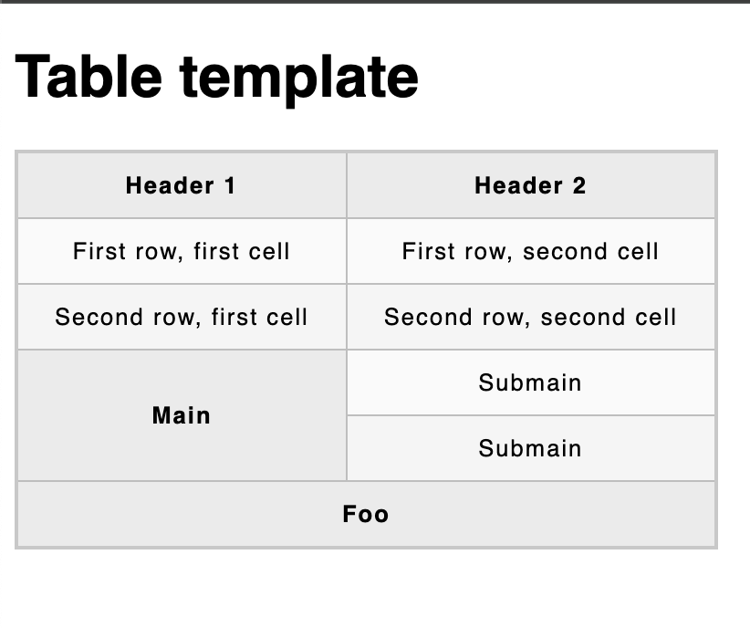

# Table basics

## Usage
```HTML
<table>
  <tr>
    <th>Header 1</th>
    <th>Header 2</th>
  </tr>
  <tr>
    <td>First row, first cell</td>
    <td>First row, second cell</td>
  </tr>
  <tr>
    <td>Second row, first cell</td>
    <td>Second row, second cell</td>
  </tr>
  <tr>
    <th rowspan="2">Main</th>
    <td>Submain</td>
  </tr>
  <tr>
    <td>Submain</td>
  </tr>
  <tr>
    <th colspan="2">Foo</th>
  </tr>
</table>
```



- `table` -> markup for table
- `td` -> a table cell
- `th` -> a table header (styles with bold and justify-center)
- `tr` -> a table row, used to group `td` together
- `rowspan` -> attribute to setting how many rows a cell/header should occupy
- `colspan` -> attribute to setting how many columns a cell/header should occupy
