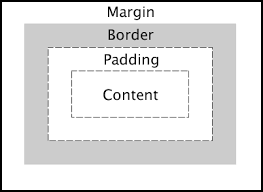

# Box Model

- Everything in CSS has a `box` around it.

## Block and inline boxes

- `display` type refers to how the box behaves in terms of page flow and in relation to other boxes on the page.
- Have an `inner` and `outer` display type.

1. `block`
    - box breaks into a new line
    - `width` and `height` are respected
    - `padding` and `margin` pushes other elements from the box.
    - Without `width`, the box will fill the container in `inline` direction.
    - `<h1>` and `<p>`
2. `inline`
    - box will not break onto a new line
    - `width` and `height` will not apply
    - `top` and `bottom` paddings, margins, and borders will apply but will not affect other inline boxes.
    - `left` and `right` paddings, margins, and borders will apply and will push other inline boxes.
    - `<a>`, `<span>`, `<em>`, and `<strong>`

## Inner and outer display types
1. `inner display type` -> Display of inner HTML elements.
2. `outer display type` -> Dictates the relationship of the box with boxes around it. Dictated by the display of the outer container.

## CSS box model

- As a whole, applies to `block` boxes. 
- `inline` boxes use just some of the behavior defined in the box model.



1. `standard box model` -> `width` and `height` refers to the dimensions of the `content box`
2. `alternate box model` -> `width` and `height` refers to the dimensions of the `whole box`. Setting the padding, margin, and border will shrink the box inside it.
```CSS
/* SETS THE CONTAINER TO ALTERNATE BOX MODEL */
.box {
  box-sizing: border-box;
}

html {
  box-sizing: border-box;
}

/* ALL THE CONTAINERS TO ALTERNATE BOX MODEL */
*,
*::before,
*::after {
  box-sizing: inherit;
}
```

### Parts of a box
1. **Content box** -> area where content is displayed (`width` and `height`)
2. **Padding box** -> sits around the content as a white space (`padding`)
3. **Border box** -> wraps padding and content box (`border`)
4. **Margin box** -> pushes boxes around the box away (`margin`)

### Margin collapsing

- Overlapping margins follow some rules.
- For example, two adjacent elements where one is set to `margin-bottom` and the other is set to `margin-top`.

1. Two positive margins will result to the largest of the two.
2. Two negative margins will collapse to the smaller value.
3. If one is negative, it is subtracted from the total.

### Inline-box
```CSS
display: inline-block;
```
- The element is still `inline` but:
  - The `width` and `height` are respected.
  - `padding`, `margin`, and `border` will cause other elements to be pushed away from the box.

